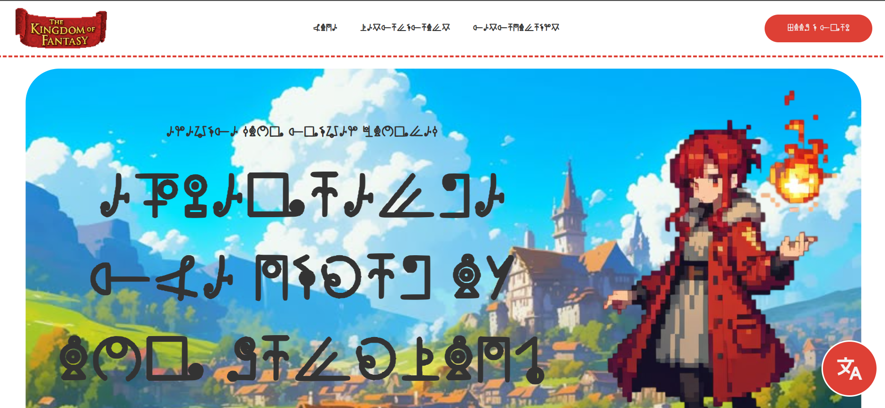
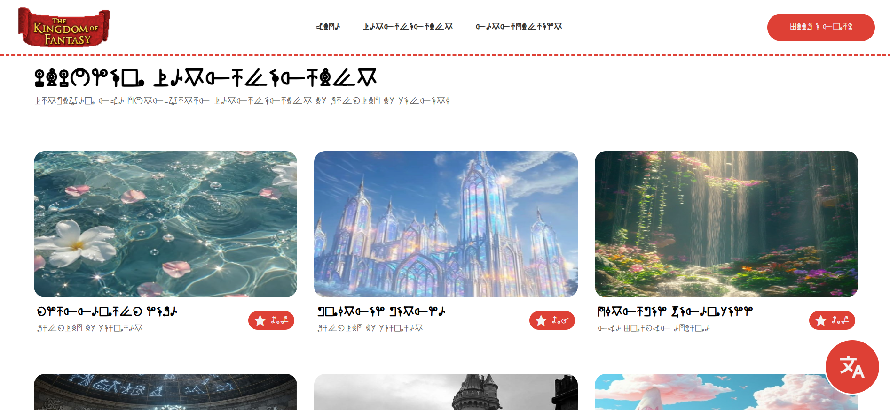
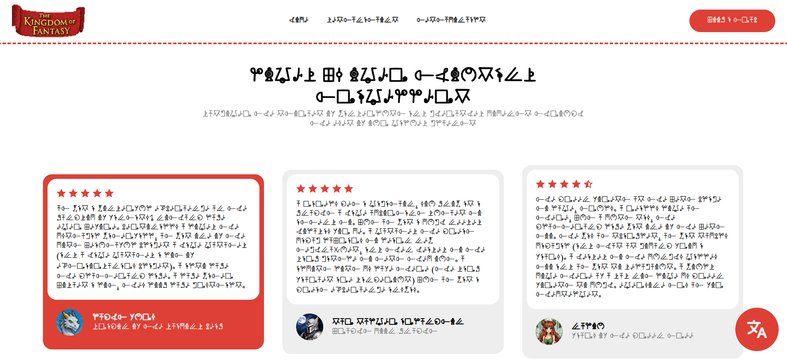

# Kingdom Of Fantasy
Tour and Travel agency's website for the Kingdom Of Fantasy

The language is the custom-made "Fantasian Alphabet" whcih is used by the people of the Kingdom of Fantasy.

> the language can be transalted to english using the translate button in the bottom right corner for us earthlings

## Features
- custom-made language (implemented as a font face)
- made like a normal tour and travel agency website but for the kingdom's people
- made up places + characters + testimonials used [NOT AI GENERATED]
- css effects so the website feels better while using

> HIGHLIGHT:
> can find the custom-made font "fantasian-alphabet" in the assets folder

## Screenshots
home section

destinations section

testimonials section

## Credits
- made by me
- assets like destination and character image: pinterest [https://in.pinterest.com/pin/1055599908260854/]
- text content: me and help from elder sister
- footer design inspiration: [https://visitabudhabi.ae/en](https://visitabudhabi.ae/en)
- a lot of the names + the font are heavily inspired by the "Kingdom of Fantasy" book series by "Geronimo Stilton". i loved reading these and used the font given in the last page as a reference for this project.
